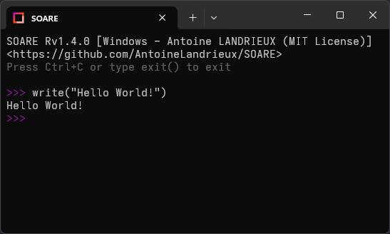

#  SOARE

SOARE is distributed under the [MIT License](LICENSE).

---



[**➡️ See more pictures**](resources/github/README.md)

## 🧑‍💻 INTERPRETER

```txt

? This is your first SOARE code !
write("Hello World!");

```

## 📖 Documentation

> [!IMPORTANT]
> See [SOARE Documentation](doc/documentation.md) and [SOARE Changelog](CHANGELOG.md)
>

## 🛠️ Recommended tools

### 1. SOARE Minifier

> [!NOTE]
> Minification involves compressing the source code of a SOARE file by removing unnecessary characters such as spaces, line breaks, indentations, and comments. This process reduces the file size so that it loads faster by the interpreter.
>

**Link**: <https://anto.infos.st/SoareMinifier/>

**Repo**: <https://github.com/AntoineLandrieux/SoareMinifier>

### 2. SOARE Language Support

> [!NOTE]
> Language Support for syntax highlighting (in Notepad++, Nano, etc) helps developers quickly identify keywords, variables, data types, and other important elements within the source code. By applying different colors, reduces the chances of errors, and aids in understanding the structure of the code more effectively.
>

**Repo**: <https://github.com/AntoineLandrieux/SoareLanguageSupport>

## 🤲 Contributing

The SOARE source code is located in the Git repository at [github.com/AntoineLandrieux/SOARE](https://github.com/AntoineLandrieux/SOARE/).
Contributions are most welcome by forking the repository and sending a pull request.

> [!IMPORTANT]
>
> Please read the [Code of Conduct](CODE_OF_CONDUCT.md) and [contribution guidelines](CONTRIBUTING.md)
>

## 📜 Credit

See **[AUTHORS file](AUTHORS)**

**Contributors :**


